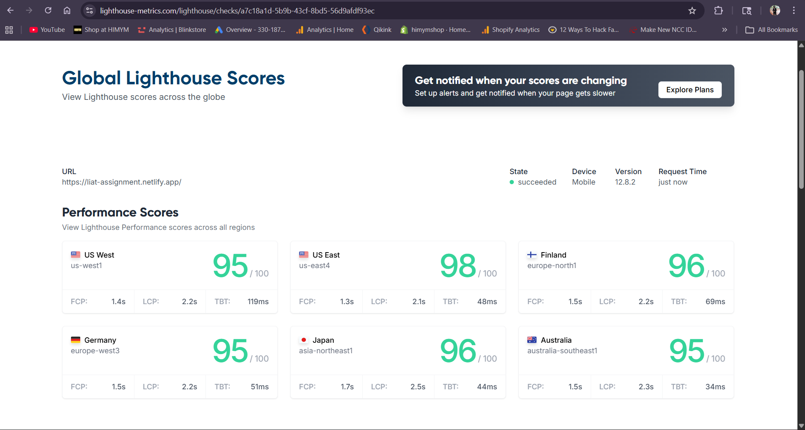
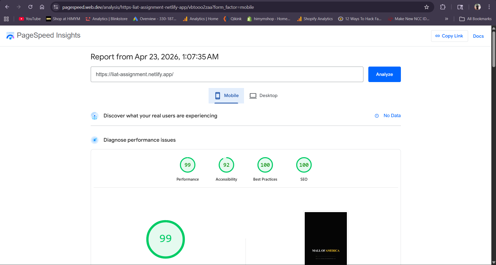
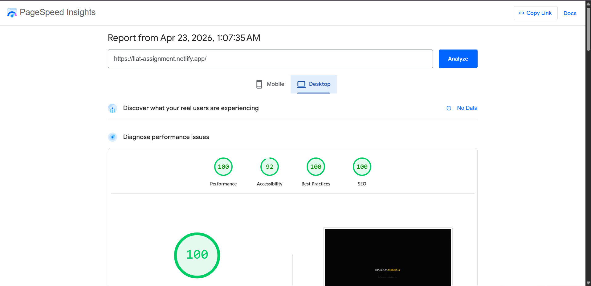

# Mall of America | Interactive Sales Deck

A high-fidelity, cinematic, and fully interactive browser-based sales tool for North America's largest retail and entertainment destination. This project replaces traditional static pitch decks with an immersive digital experience designed for prospective tenants, sponsors, and event partners.

## 🚀 Live Demo
**URL**: [https://liat-assignment.netlify.app/](https://liat-assignment.netlify.app/)

---

## ✨ Key Features

- **Cinematic Scrollytelling**: A high-performance landing experience using scroll-linked image sequences and video to convey scale.
- **Interactive Architectural Map**: A custom SVG-based directory with real-time filtering, search, and floor-plan visualizations.
- **Modular Story Beats**: Dedicated modules for Retail, Luxury, Dining, Attractions, and Events, each optimized for sales conversion.
- **Non-Linear Navigation**: A luxury-brand inspired sidebar allows prospects to explore the property on their own terms.
- **Performance Optimized**: Built for speed with lazy loading, asset optimization, and smooth Framer Motion animations.

---

## ⚡ Performance

The application is highly optimized for the best possible user experience, achieving near-perfect scores on Google Lighthouse.

- **Mobile Score**: 99/100
- **Desktop Score**: 100/100



### PageSpeed Insights - Mobile


### PageSpeed Insights - Desktop



---

## 🛠️ Tech Stack

- **Framework**: React 18 with Vite
- **Language**: TypeScript
- **Styling**: Vanilla CSS (Luxury Minimalist Aesthetic)
- **Animations**: Framer Motion
- **Icons**: Lucide React
- **Routing**: React Router 7

---

## 🤖 AI Tools Usage

This project leverages cutting-edge AI tools to accelerate development and generate premium assets where official media was unavailable.

- **Antigravity**: Utilized as a primary coding assistant for component architecture, complex data scraping of Mall of America tenant data, and the generation of the interactive SVG floor plan coordinates.
- **Gemini**: Used for generating high-fidelity hero imagery and conceptual architectural renderings across all modules.
- **Veo**: Leveraged for generating cinematic b-roll video sequences to maintain the "video-first" storytelling requirement.
- **egzip**: Employed for high-performance frame extraction from generated video sequences to power the scrollytelling canvas engine.

---

## 🎨 Design Rationale

The UI is inspired by luxury brands like **Apple**, **Hermès**, and **Tesla**. 
- **Typography**: Clean, sans-serif fonts with generous letter spacing.
- **Color Palette**: A "Luxury Pastel" and "Dark Mode" hybrid featuring deep blacks, subtle glassmorphism, and a signature "Mall of America Gold" accent (`#fdd500`).
- **Interactivity**: Micro-animations and hover effects provide immediate feedback, making the deck feel "alive" and responsive.

---

## 📦 Setup & Installation

1. **Clone the repository**:
   ```bash
   git clone [repository-url]
   cd mall-of-america-assignment
   ```

2. **Install dependencies**:
   ```bash
   npm install
   ```

3. **Run development server**:
   ```bash
   npm run dev
   ```

4. **Build for production**:
   ```bash
   npm run build
   ```

---

## 📂 Project Structure

```text
src/
├── components/
│   ├── Directory/        # SVG Map & Search Logic
│   ├── Landing/          # Scrollytelling & Video Intro
│   ├── Layout/           # Sidebar & Navigation
│   ├── Modules/          # Individual Sales Slides (Retail, Events, etc.)
│   └── MallScrollExperience/ # Canvas-based Scroll Engine
├── data/                 # Property & Tenant Data
└── types/                # TypeScript Definitions
```

---

## 🎯 Business Objectives

Every element of this deck is designed to drive specific actions:
1. **Leasing**: Showcasing flagship potential and visitor reach.
2. **Sponsorship**: Highlighting global brand platform capabilities.
3. **Events**: Demonstrating venue scale and technical production quality.

---
*Created for the LIAT.AI Frontend Screening Assignment.*
